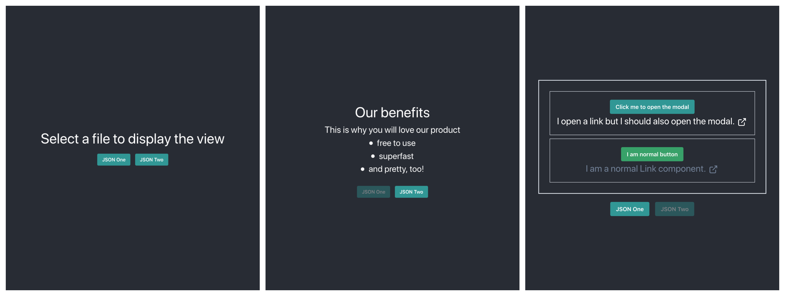

# Conversional-json App



This project was bootstrapped with [Create React Index](https://github.com/facebook/create-react-app).

## Prerequisites

- node8
- yarn

## Install

1. Clone this repository.
2. Run `yarn`.


## Available Scripts

In the project directory, you can run:

## Running the application

2. Run `yarn start` to start the client.
3. Check it out under:  `http://localhost:3000`.

## Solution

### Project structure

The project consists of two directories and the helper files.

#### `src`

Source directory composed of three sub-directories: `data-client`, `modal-context` and `components`.

#### `public`

Public files for the project.

### Approach

* Data-client stores two JSON files, which represent two different pages in application.
* First view of the application lets a user decide, what page to view.
* Based on the selected JSON file, the FactoryComponent (`src/components/FactoryComponent/`) creates a page based on JSON data in the selected file.
* The application UI is built with the `chakra-UI` React component library.
* Testing is completed with `Jest` and `@testing-library/react`. The following components were tested, for showcase purposes:
    - [x] Actions (`src/common/actions/__tests__/actions.js`),
    - [x] Reducers (`src/common/reducers/__tests__/reducers.js`),
    - [x] Data-service index (`src/data-service/index/__tests__/index.js`),
    - [x] HomePage component (`src/components/pages/homepage/ui/__tests__/HomePage.js`),
    - [x] Spinner component (`src/components/Spinner/__tests__/Spinner.js`),
* The testing in this solution includes only unit tests. That could be extended with component, integration, and e2e for
a production-ready product.

### Additional requirements

* In order to distinguish the behavior of the link and the button components, JSON file for each component should contain the `modalName` field with the name of the modal, such as:
```json
          {
            "type": "BUTTON_COMPONENT",
            "id": "sadasdiqeo1u211",
            "props": {
              "modalName": "baseModal",
              "text": "Click me to open the modal"
            }
          },
          {
            "type": "LINK_COMPONENT",
            "id": "sdasidj98394",
            "props": {
              "modalName": "urlModal",
              "url": "https://lmgtfy.com/",
              "text": "I open a link but I should also open the modal."
            }
          },
```
* Based on this field, the component renders with the desired behaviour.

### Libs/tools used

* [ES8](https://www.ecma-international.org/ecma-262/8.0/)
* [React](https://facebook.github.io/react/)
* [Chakra UI](https://chakra-ui.com/)
* [Jest](http://facebook.github.io/jest/)
* [React Testing Library](https://testing-library.com/)

## License

The MIT License (MIT)